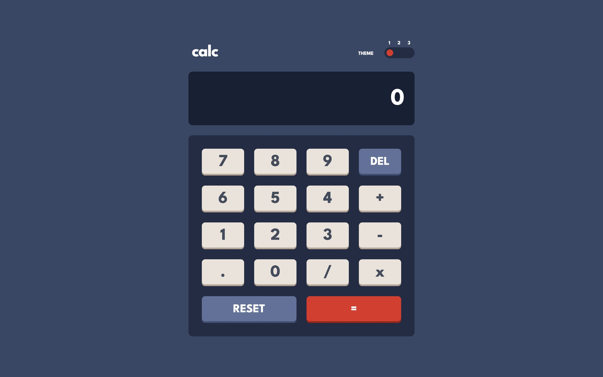
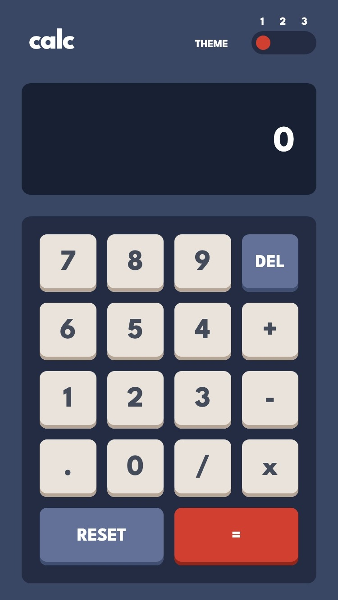

# Frontend Mentor - Calculator app solution

This is a solution to the [Calculator app challenge on Frontend Mentor](https://www.frontendmentor.io/challenges/calculator-app-9lteq5N29). Frontend Mentor challenges help you improve your coding skills by building realistic projects.

## Table of contents

- [Frontend Mentor - Calculator app solution](#frontend-mentor---calculator-app-solution)
  - [Table of contents](#table-of-contents)
  - [Overview](#overview)
    - [The challenge](#the-challenge)
    - [Screenshot](#screenshot)
    - [Links](#links)
    - [Built with](#built-with)
    - [Useful resources](#useful-resources)

## Overview

### The challenge

- Use LitElement + TailwindCSS
- Use Vite and Vitest along side Open WC for Testing 
- Use fluid typografy and fluid spacing from utopia
- Configure TailwindCSS with the project style-guide
- Configure TailwindCSS plugins

Users should be able to:

- View the optimal layout depending on their device's screen size

### Screenshot

### Links

- Solution URL: [here](https://github.com/AGutierrezR/calculator-app)
- Live Site URL: [here](https://resilient-peony-bec161.netlify.app/)

### Built with

- Semantic HTML5 markup
- LitElement
- [Tailwind CSS](https://tailwindcss.com/)
- Mobile-first workflow

### Useful resources

- [LitElement](https://lit.dev/) - LitElement Documentation.
- [Tailwind Docs](https://tailwindcss.com/docs/configuration) - Tailwind CSS Documentation.
